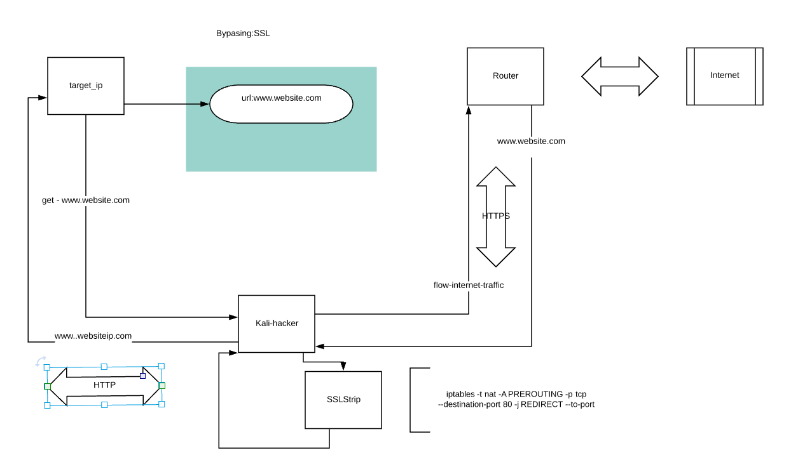
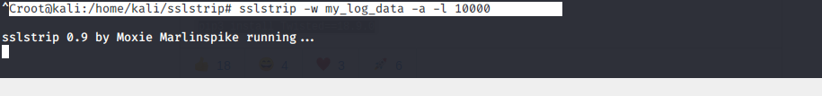

## Hacking With Python 

In this page i'm going to explain how to hacking other machines on the same network, using yout own python tools and Kali linux OS

Index:

    1. Arp_spoofing
        a. Change Mac Address
        b. Network Discover
        3. arp_spoofing
    2. Sniffer data
    3. DNS Spoofing
    4. Replace Download packets
    5. Code injection
    6. By Passing HTTPS

## 1.ARP spoofing:

You can find all the tools that you make an ARP spoofing attack on the following link:

[https://github.com/f0ns1/evilHackingPythonTool.git]

include descriptions, how to use it, examples etc.

And our fisrt step is create an Man in the middle between the target_host and network router

The tool of theprevious link make this automatically for us, with interctaive shell

as you can see on the image the same tool allow execute the nexte functions too:

  
          a. Change Mac Address
          b. Network Discover

With this environment, the traffic between the target ip and internet is forward by our Operative system. 
This priviledge possition allow the attacker to make many different kinds of operations, for ecample:
    
          - sniff traffic
          - dns spoofing
          - code injection
          - refirect downloads to our evil server

## 2. Sniffer data (Over MitM)

In order to make this attack, i provide the link from a custom tool, that sniff traffic over http, 
andlook for credentials, session user on the raw layer packets.
Cuould be use for search cookies or whaever you want.

[https://github.com/f0ns1/evilSImpleSnifferPython.git]

Over position of MitM, we can use the tool for sniff the network user traffic:

Execution, sniffer data with filters example:

## 3.DNS Spoofing (Over MitM)

In that case we makean attack of DNS spoofing type, we explote the man in the middle condition too. The easy tactic is modify the response of DNS packetsover HTTP request from target ip to DNS. We force to victim to get petition to our evil webserver with a fake webpage.

The custom python tool:

[https://github.com/f0ns1/mitm_process.py/blob/master/README.md]

Logic architecture from attack:

Attack example, on victim browser:

Execution: (url1) --> (code:url2)

##4. Replace Download packets (Over MitM)

Custom replace download packet tool location:

[https://github.com/f0ns1/mitm_process.py/blob/master/README_Replace_dwnloads.md]

code:

[ttps://github.com/f0ns1/mitm_process.py/blob/master/replace_downlad.py]

Logic architecture:

Examples of download replacement, original website:

replacement by evil content:

## 5. Code injection (Over MitM)

Java Script code injection, in that case the best code injection attack is use an js packet from BeeF Framework, allow you control the victim browser:

[https://github.com/f0ns1/mitm_process.py/blob/master/code_injection.py]

Logic architecture:

Example:

BeeF framework link:
https://tools.kali.org/exploitation-tools/beef-xss

## 6.Passing HTTPS (Over MitM)

In order to make attack over Https layer we are going to use external kali Linux tool: SSLString 
SSLstrinp  github link: https://github.com/moxie0/sslstrip.git

We must configure our local architecture and iptables in order to prerouting all traffic that forward for our hostto the sslstrip tool.
But after or before, request or response dependes of the attack type, we continue modifiying http packets over http layer.

Logic attck Architecture:

Tool sslStrip, afeter install and configure:

Downgrade user browser web from : HttpS  to: Http protocol

Custom python filter search over https downgrade to http:

SSl strip log all example:

